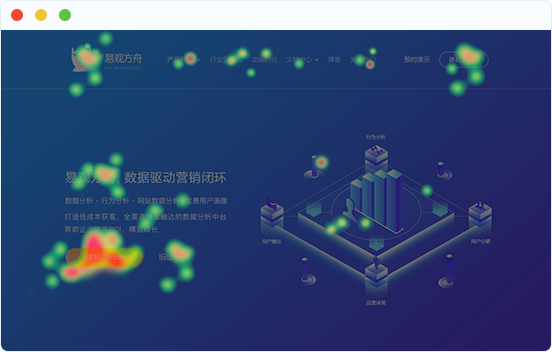
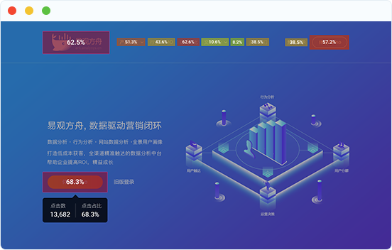
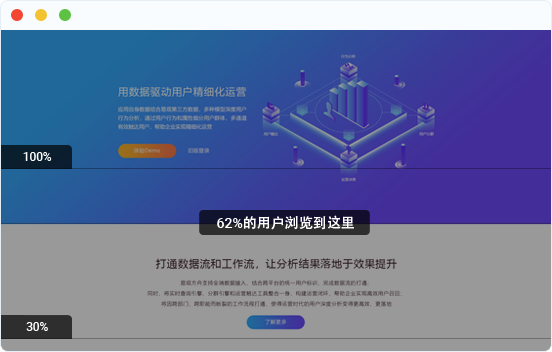
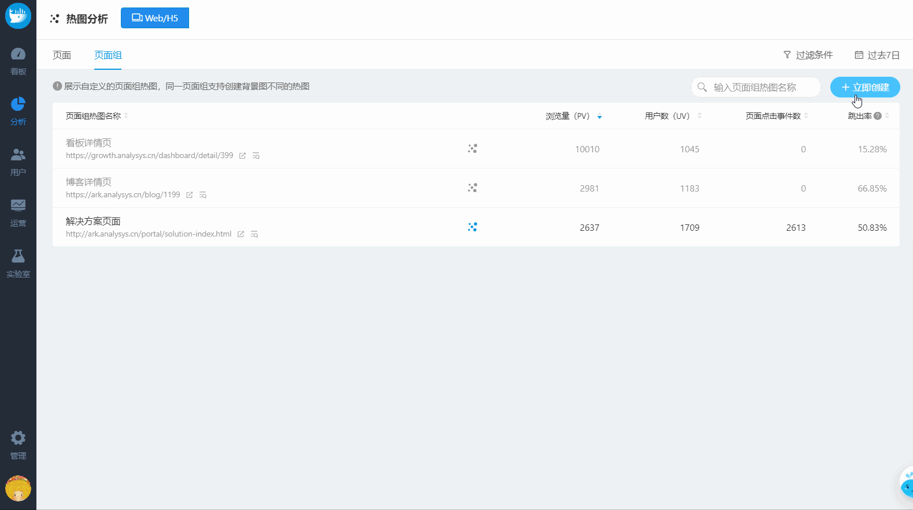
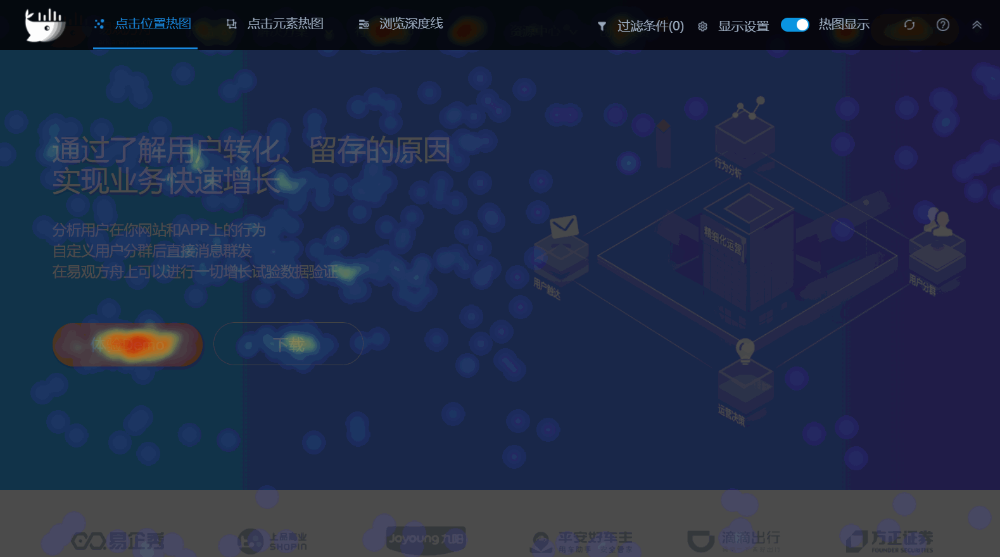

# Web/H5 热图

Web 端支持点击位置热图、点击元素热图和浏览深度线，支持在方舟网站中查看，也支持在网站原页面上查看















## 使用前准备

使用**点击位置热图、点击元素热图**功能，需要 SDK 升级到 v4.3.0 及以上，设置 `autoHeatmap` 为 `true`，详见 [《JS SDK 集成指南》](../../../integration/sdk/js/js.md#autoheatmap)

使用**浏览深度线**功能，需要 SDK 设置 `autoWebstay` 为 `true`，详见 [《JS SDK 集成指南》](../../../integration/sdk/js/js.md#autowebstay)

## 1. 页面/页面组热图列表

支持合参页面、原始页面、页面组三种页面的热图，三者的区别：



<table>
  <thead>
    <tr>
      <th style="text-align:left">
        
<b>&#x5408;&#x53C2;&#x9875;&#x9762;&#x662F;&#x6307;&#x53BB;&#x9664;&#x5C3E;&#x90E8;&#x53C2;&#x6570;&#x7684;&#x76F8;&#x540C;URL&#x7684;&#x9875;&#x9762;</b>
        

        
&lt;b&gt;&lt;/b&gt;

        
&#x5408;&#x53C2;&#x9875;&#x9762;&#x89E3;&#x51B3;&#x53C2;&#x6570;&#x4E0D;&#x540C;&#x4F46;&#x5B9E;&#x9645;&#x662F;&#x540C;&#x4E00;&#x4E2A;&#x9875;&#x9762;&#x7684;&#x95EE;&#x9898;&#xFF0C;&#x7CFB;&#x7EDF;&#x81EA;&#x52A8;&#x5408;&#x5E76;&#xFF0C;&#x5408;&#x53C2;&#x524D;&#x540E;&#x9875;&#x9762;&#x672C;&#x8EAB;&#x4E0D;&#x53D8;&#x3002;
           
           &#x5982;&#x4E0A;&#x4E3E;&#x4F8B;&#xFF0C;&#x5728;&#x4E0D;&#x540C;&#x7684;&#x63A8;&#x5E7F;&#x6E20;&#x9053;&#x5E26;&#x4E0D;&#x540C;&#x7684;&#x53C2;&#x6570;&#xFF0C;&#x539F;&#x59CB;&#x9875;&#x9762;&#x4F1A;&#x4E0D;&#x540C;&#xFF0C;&#x4F46;&#x7740;&#x9646;&#x9875;&#x76F8;&#x540C;&#xFF0C;&#x4E3A;&#x4E86;&#x5206;&#x6790;&#x7528;&#x6237;&#x5728;&#x7740;&#x9646;&#x9875;&#x672C;&#x8EAB;&#x7684;&#x884C;&#x4E3A;&#x65F6;&#xFF0C;&#x5C31;&#x9700;&#x8981;&#x5C06;&#x4E0D;&#x540C;&#x53C2;&#x6570;&#x7684;&#x540C;&#x4E00;&#x9875;&#x9762;&#x8FDB;&#x884C;&#x6C47;&#x603B;&#x3002;

      </th>
    </tr>
  </thead>
  <tbody></tbody>
</table>



<table>
  <thead>
    <tr>
      <th style="text-align:left">
        
<b>&#x9875;&#x9762;&#x7EC4;&#x662F;&#x5177;&#x6709;&#x5171;&#x540C;&#x7ED3;&#x6784;&#x7279;&#x5F81;&#x7684;&#x9875;&#x9762;&#x96C6;&#x5408;</b>
        

        
&lt;b&gt;&lt;/b&gt;

        
&#x89E3;&#x51B3;&#x53C2;&#x6570;&#x4E0D;&#x540C;&#x3001;&#x9875;&#x9762;URL&#x4E0D;&#x540C;&#x3001;&#x4F46;&#x5B9E;&#x9645;&#x662F;&#x540C;&#x4E00;&#x4E2A;&#x9875;&#x9762;&#x7ED3;&#x679C;&#x7684;&#x95EE;&#x9898;&#xFF0C;&#x9700;&#x8981;&#x624B;&#x52A8;&#x5B9A;&#x4E49;&#x3002;
           
           &#x6709;&#x5F88;&#x591A;&#x9875;&#x9762;&#x7ED3;&#x6784;&#x672C;&#x8EAB;&#x662F;&#x76F8;&#x540C;&#x7684;&#xFF0C;&#x6BD4;&#x5982;&#x5546;&#x54C1;&#x8BE6;&#x60C5;&#x9875;&#x3001;&#x65B0;&#x95FB;&#x8D44;&#x8BAF;&#x9875;&#x3001;&#x535A;&#x5BA2;&#x5185;&#x5BB9;&#x9875;&#x7B49;&#xFF0C;&#x53EA;&#x662F;&#x5176;&#x4E2D;&#x7684;&#x5185;&#x5BB9;&#x4F1A;&#x6709;&#x5DEE;&#x5F02;&#xFF0C;&#x5982;&#x679C;&#x9700;&#x8981;&#x5BF9;&#x540C;&#x4E00;&#x4E2A;&#x7ED3;&#x6784;&#x7279;&#x5F81;&#x7684;&#x9875;&#x9762;&#x8FDB;&#x884C;&#x5206;&#x6790;&#xFF0C;&#x5C31;&#x53EF;&#x4EE5;&#x521B;&#x5EFA;&#x9875;&#x9762;&#x7EC4;&#xFF0C;&#x5982;&#x4F55;&#x521B;&#x5EFA;&#x8BE6;&#x89C1;
          <a
          href="../../project-manegement/meta-data/pagegroup.md#1-chuang-jian-ye-mian-zu">&#x300A;&#x9875;&#x9762;&#x7EC4;&#x7BA1;&#x7406;&#x300B;</a>&#x3002;

      </th>
    </tr>
  </thead>
  <tbody></tbody>
</table>



<table>
  <thead>
    <tr>
      <th style="text-align:left">
        
<b>&#x539F;&#x59CB;&#x9875;&#x9762;&#x662F;&#x6307;&#x6CA1;&#x6709;&#x53BB;&#x9664;&#x5C3E;&#x90E8;&#x53C2;&#x6570;&#x7684;&#x9875;&#x9762;&#xFF0C;&#x4FDD;&#x5B58;&#x539F;&#x6765;&#x7684;URL</b>
        

        
&lt;b&gt;&lt;/b&gt;

        
&#x62FF;&#x65B9;&#x821F;&#x9996;&#x9875;&#x4E3E;&#x4F8B;&#xFF0C;&#x6B63;&#x5E38;&#x6765;&#x8BF4;&#x5730;&#x5740;&#x5E94;&#x8BE5;&#x662F;
          <a
          href="https://ark.analysys.cn/">https://ark.analysys.cn</a>&#xFF0C;&#x4F46;&#x5F88;&#x591A;&#x65F6;&#x5019;&#x4E3A;&#x4E86;&#x63A8;&#x5E7F;&#xFF0C;&#x4F1A;&#x628A;&#x94FE;&#x63A5;&#x653E;&#x5230;&#x628A;&#x5B83;&#x653E;&#x5728;&#x4E0D;&#x540C;&#x7684;&#x5730;&#x65B9;&#xFF0C;&#x5C31;&#x9700;&#x8981;&#x52A0;&#x4E0A;&#x4E0D;&#x540C;&#x7684;&#x53C2;&#x6570;&#x6765;&#x6807;&#x8BC6;&#x6765;&#x6E90;&#xFF0C;&#x901A;&#x8FC7;&#x4F1A;&#x5728;&#x94FE;&#x63A5;&#x540E;&#x9762;&#x52A0;&#x95EE;&#x53F7;
            &#xFF1F;&#x52A0;&#x4E0D;&#x540C;&#x7684;&#x53C2;&#x6570;&#xFF0C;&#x4F8B;&#x5982;
            <a
            href="https://ark.analysys.cn/?utm_campaign=on&amp;utm_medium=media&amp;utm_source=analysys&amp;utm_content=fzbutton&amp;utm_term=guide%EF%BC%8C">https://ark.analysys.cn/?utm_campaign=on&amp;utm_medium=media&amp;utm_source=analysys&amp;utm_content=fzbutton&amp;utm_term=guide&#xFF0C;</a>&#x90A3;&#x7528;&#x6237;&#x901A;&#x8FC7;&#x8FD9;&#x4E2A;&#x94FE;&#x63A5;&#x6253;&#x5F00;&#x7684;&#x5373;&#x4E3A;&#x539F;&#x59CB;&#x9875;&#x9762;&#x3002;

      </th>
    </tr>
  </thead>
  <tbody></tbody>
</table>



### **页面热图列表**

热图通常用于分析着陆页，而着陆页的浏览量一般较大，所以方舟会默认展示出浏览量（PV）TOP 20 的合参页面列表，可以根据跳出率、点击事件数等指标判断是否需要进一步查看相应页面的热图。

#### **展示的指标**

| 指标 | 说明 |
| :--- | :--- |
| 浏览量（PV） | PageView，指用户浏览某个页面或某个页面组的总次数。 |
| 用户数（UV） | Unique Visitor， 访问用户的去重数。 |
| 页面点击事件数 | 用户在页面上点击的总数 |
| 跳出率 | 计算当前页为着陆页时的跳出率，结果为 `-` 时，表示当前页非着陆页。 跳出率=访问了一个页面的Session数/总的 Session 数。用户进入着陆页就离开。用户来到网站后，除了浏览 LandingPage 之外，没有发生其他任何操作就离开了网站，被视为跳出。用来衡量 landingpage 的质量。 |

点击 **页面标题** 或者 **热图图标**，即可进入具体的热图页面进行分析，详见 [2. 点击位置热图](https://docs.analysys.cn/ark/features/analytics/heatmap#2-dian-ji-wei-zhi-re-tu)


当页面事件数为 0 时，即表示缺少绘制热图需要的数据，可能是以下原因之一，需要逐一排查

1. 还没有用户访问当前页面
2. 当前所选时间范围、过滤条件下没有用户访问行为，可以重新调整筛选条件
3. SDK 未开启热图功能，即设置 `autoHeap` 为 `true`


**辅助功能**

#### **A 过滤条件**

支持通过时间、分群、事件属性和用户属性过滤，满足分析在特定时间段特定人群行为的需求

#### **B 搜索**

支持从全部页面中搜索，不仅仅是浏览量 TOP 20 的页面

#### **C 星标置顶**

对于最常关注的页面，可以移入所在行，点击列头的星标置顶在列表上方，此时列表总共会展示 星标页面 + 额外浏览量 TOP 20 的页面

#### **D 排序**

默认星标的页面置顶在上方，剩余页面按照浏览量（PV）从大到小排序；

支持按照各个字段和是否星标重新排序。

#### **E 打开原页面**

移入链接后面打开网页的 icon，点击即可新标签页打开原始网页

#### **F 下钻查看原始页面**

移入链接后面查看原始页面的icon，点击即可查询该合参页面的原始页面数据

默认展示浏览量 TOP 20 的原始页面

### **页面组热图列表**

页面组是具有共同结构特征的页面集合，如商品详情页、新闻资讯页。方舟支持在设定的背景页面上绘制具有页面组的点击行为热度。

#### 创建页面组热图

点击 **+ 立即创建** ，打开右侧抽屉，三步创建

1. 选择要进行热图分析的页面组：在[页面组管理](../../project-manegement/meta-data/pagegroup.md)中创建的页面组中选择，也支持新创建
2. 设置背景图：作为渲染热图的底图
3. 命名热图：页面组热图名称不能重复


注意事项：

1 页面组中的页面结构相同时分析热图才有意义

2 设置的背景图需要和页面组中的页面属于同一结构，才能将页面组中的点击行为汇总渲染在背景图上，否则无法展示热图


页面组热图列表中仅展示自己创建的页面组热图。

#### 展示的指标

同页面热图列表，详见上方 [页面热图列表-展示的指标](https://docs.analysys.cn/ark/features/analytics/heatmap/web#ye-mian-re-tu-lie-biao)

**辅助功能**

#### **A 过滤条件**

支持通过时间、分群、事件属性和用户属性过滤，满足分析在特定时间段特定人群行为的需求

#### **B 搜索**

支持根据页面组热图名称搜索

#### **C 排序**

默认按照浏览量（PV）从大到小排序，支持按照各个字段重新排序。

#### **D 打开背景原页面**

移入链接后面打开网页的 icon，点击即可新标签页打开创建页面组热图时选择的背景页

#### **E 下钻查看原始页面**

移入链接后面查看原始页面的icon，点击即可查询该页面组的原始的页面

默认展示浏览量 TOP 20 的原始页面

## 2. 点击位置热图

点击位置热图展示用户在网站上所有点击的位置，聚集的点击越多，颜色越亮。

* 通常用于分析着陆页，判断用户是否点击了CTA的内容？
* 否有被大量点击的重要按钮或元素被放到了很少有用户到达的地方？ 
* 是否有用户点击的图片或文字其实没有链接等等

**支持两种查看热图的方式：**

* 嵌入式：在方舟当中直接查看热图
* 交互式：打开原页面查看，关闭热图时，可以与原页面交互


无论是哪种热图查看方式，展示的都是在指定过滤条件和时间范围下的用户的行为，默认所有用户，过去7日的数据；

当在热图列表时就选择了条件，条件在热图页的时候仍然生效；同时支持再次修改条件。


### 嵌入式热图

对于支持 iframe 嵌入和 https 协议的页面可以在方舟产品中直接查看热图 

**辅助功能**

#### A 选择终端设备类型

通常同一网站在不同终端（e.g. PC、手机）上会做适配，即用户在不同终端上看到的页面布局甚至是部分的内容会不同，用户的行为也会不同。

用户可以选择左上角切换不同的终端，会呈现出不同终端情况下看到网页，渲染出相应的热图，目前支持查看三种终端下的用户行为热图：

* PC
* 平板
* 手机

比如切换到手机，即可查看在在手机终端上用户查看网页时的热图。

#### B 显示设置

* **B1 显示浏览深度线**

        打开后可以在热图中同时查看浏览深度线

* **B2 调整颜色范围**

        可以调整最大值-最小值的颜色范围，以适应默认颜色区间在背景色上无法突出标识的情况

* **B3 调整背景透明度**

         ****可以调整热图背景透明度，以适应默认透明度下部分背景网页可能无法识别的情况

#### **C 热图开关**

关闭热图后可以与原页面进行交互，当存在弹窗时，可点击后再打开热图刷新，查看弹窗中的点击热图

#### **D 强制刷新**

当选择同样条件查看热图时，会存在缓存；或者是与原页面产生交互需要重新计算热图数据时，可以点击刷新，强制重新计算

#### **E 帮助文档**

使用过程中有疑问时，可以查看帮助文档

#### **F 原页面打开**

点击原页面打开，可以新标签页跳转到原网站地址查看热图

### 交互式热图

对于符合以下特征的页面无法在方舟查看热图

* 网站禁止了 iframe 的加载
* 网站没有使用 https 协议

此时可以打开原页面查看交互式热图

**辅助功能**

#### **A-D 显示设置、热图开关、强制刷新、帮助文档的使用同嵌入式热图**

#### **E 展开/收起**

通常页面头部是导航位置，但默认会被热图工具条遮挡，点击可以收起；当需要进行热图设置时，可以点击再次展开。

## 3. 点击元素热图

点击位置热图呈现的是用户任意位置的点击热度，用于定性的分析，发现预料之外的使用情况；

而点击元素热图呈现的是用不点击可交互元素的点击的，用于定量分析具体按钮、链接等关键元素的点击情况。

通常用于分析：

* 具体是哪些元素吸引了多少点击？占据了整页点击多少比例？
* 是否有不符合我们预期的失误诱导？在这里流失了多少用户？
* 在重要的按钮或元素上框选一下，看看留下点击的访问者来自于哪些渠道、具备哪些特征


可交互元素包括：

a标签、button、input、select、textarea、svg标签且含有x:href的子元素


同样支持嵌入式和交互式两种

默认显示TOP20点击次数的元素，点击热门元素列表可查看

其他可交互元素的移入元素可查看

## 4. 浏览深度线

浏览深度线代表用户抵达此区域后的留存比例。百分比越低，越少用户能够看到这一位置。

通用用于：

1. 寻找CTA的最佳位置
2. 内容营销转换监测e.g.数据骤降时，说明哪里出现了内容上的断裂，用户没有兴趣再看下去

同时可以在点击位置热图/点击元素热图的工具条中打开显示浏览深度线

打开后即可以两种结果叠加查看

## 常见问题

### 1 要使用热图的话，SDK集成时需要特殊配置吗？

需要，使用**点击位置热图、点击元素热图**功能，需要 SDK 升级到 v4.3.0 及以上，设置 `autoHeatmap` 为 `true`；使用**浏览深度线**功能，需要 SDK 设置 `autoWebstay` 为 `true`，详见 [《JS SDK 集成指南》](../../../integration/sdk/js/js.md#autowebstay)

### 2 为什么 SDK 集成正确，但默认进入热图还是看不到结果？

 逐项检查以下内容：

① 部署的方舟平台和网站是否是相同协议。若部署的方舟的为 HTTP 协议，分析的网站为 HTTPS ，则无法加载。原因： HTTPS 协议的网站中禁止访问 http 的 API 接口，所以部署后建议尽量使用的HTTPS 协议

② 网站是否禁止了iframe 加载。若禁止了，只能在原页面打开

③ 连接要分析的网站时超时 （超过 5s）

④ 连接要分析的网站不存在

⑤ 热图的时间范围内是否产生了真实的行为，**默认过去 7 日**，若当日接入查看，务必选择包含今日

### 3 热图计算的是全量数据吗？

当热图数据过大时，会导致浏览器崩溃或卡死，为了避免这种情况，同时保证数据能更真实的反映实际情况，当点击量超过7000时，我们会均匀抽样7000个点来渲染热图。

### 4 改变浏览器窗口大小时绘制的热图问题

当浏览器窗口大小改变后，绘制的结果就不再准确，此时点击强制刷新来调整热图。

### 5 页面改版后的无法溯源查看历史热图了吗？

目前是实时获取当前目标页面，根据当前页面中的元素位置及点击位置与元素顶点距离计算点击位置，根据元素路径及元素类型实时生成热图数据。历史热图暂不支持保存，但在考虑中。

### 

