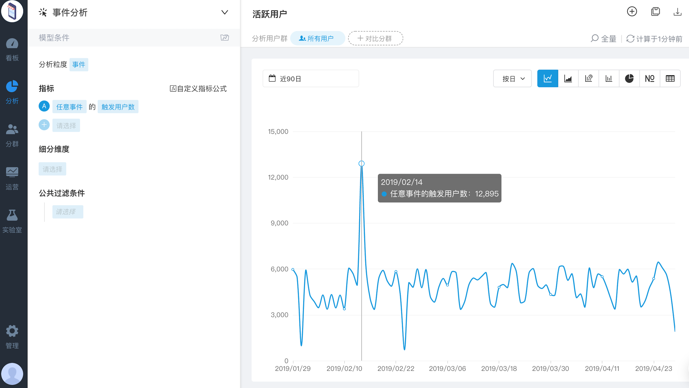
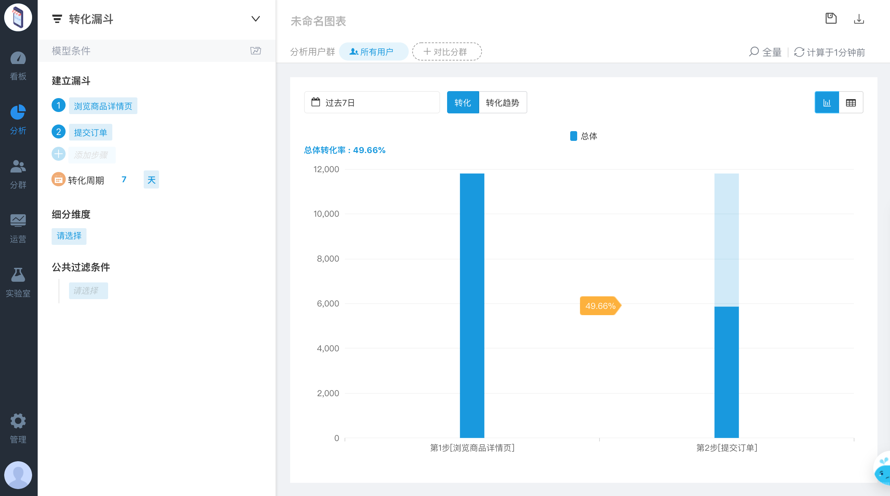
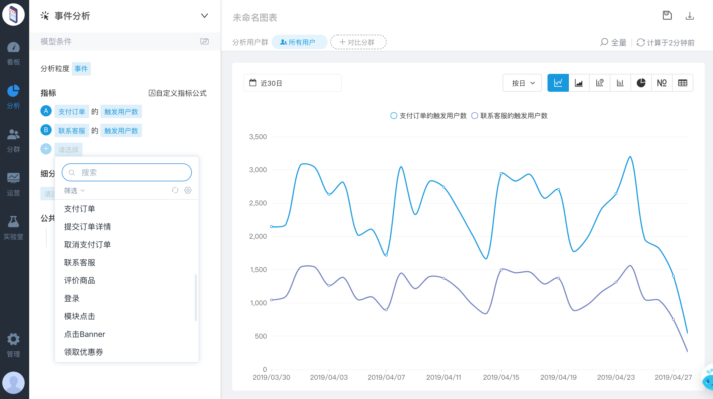
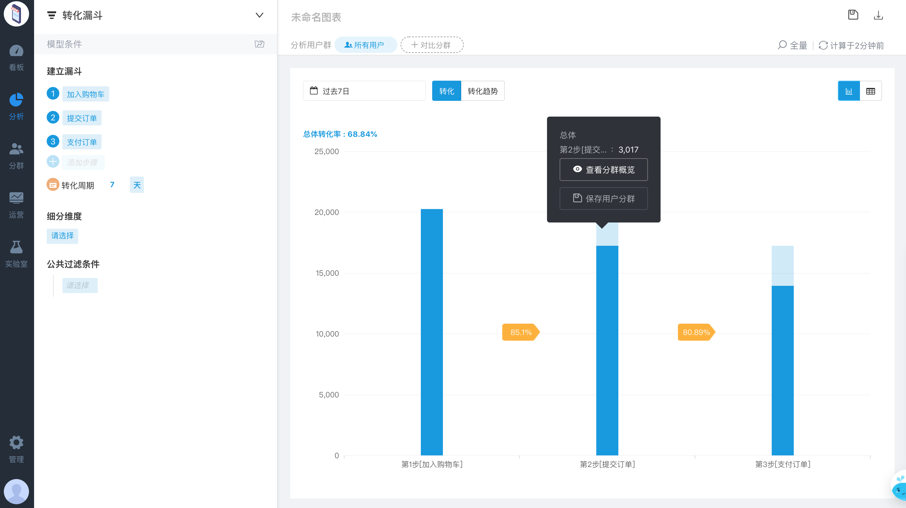
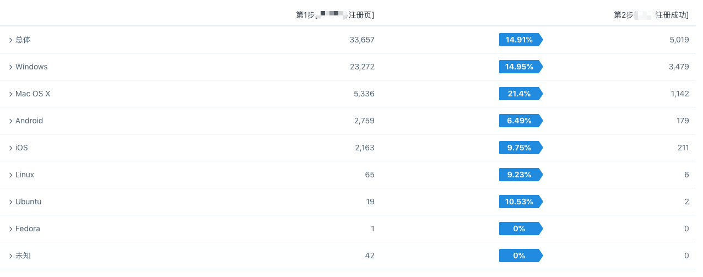

# 指标说明

## **什么是指标？**

指标是量化衡量标准、衡量目标的单位或方法，Web、APP、小程序上的指标分为：

<table>
  <thead>
    <tr>
      <th style="text-align:left">&#x7C7B;&#x578B;</th>
      <th style="text-align:left">&#x8BF4;&#x660E;</th>
    </tr>
  </thead>
  <tbody>
    <tr>
      <td style="text-align:left"><b>&#x7528;&#x6237;&#x7EA7;&#x6307;&#x6807;</b>
      </td>
      <td style="text-align:left">&#x4EE5;&#x7528;&#x6237;&#x8FDB;&#x884C;&#x5206;&#x7C7B;&#xFF0C;&#x5305;&#x542B;&#x7528;&#x6237;&#x6570;&#x91CF;&#xFF0C;&#x89E6;&#x53D1;&#x67D0;&#x4E8B;&#x4EF6;&#x7684;&#x7528;&#x6237;&#x6570;&#x91CF;&#x7B49;</td>
    </tr>
    <tr>
      <td style="text-align:left"><b>&#x8BBF;&#x95EE;&#x7EA7;&#x6307;&#x6807;</b>
      </td>
      <td style="text-align:left">&#x4EE5;&#x8BBF;&#x95EE;&#x8FDB;&#x884C;&#x5206;&#x7C7B;&#xFF0C;&#x5305;&#x542B;&#x8BBF;&#x95EE;&#x91CF;&#xFF0C;&#x8BBF;&#x95EE;&#x6B21;&#x6570;&#xFF0C;&#x8BBF;&#x95EE;&#x65F6;&#x957F;&#x7B49;&#x76F8;&#x5173;&#x7684;&#x6307;&#x6807;</td>
    </tr>
    <tr>
      <td style="text-align:left"><b>&#x884C;&#x4E3A;&#x7EA7;&#x6307;&#x6807;</b>
      </td>
      <td style="text-align:left">
        
&#x884C;&#x4E3A;&#x7EA7;&#x6307;&#x6807;&#x662F;&#x7EDF;&#x8BA1;&#x5206;&#x6790;&#x7528;&#x6237;&#x884C;&#x4E3A;&#x7684;&#x6307;&#x6807;&#xFF0C;&#x5E38;&#x7528;&#x4E8E;&#x67D0;&#x884C;&#x4E3A;&#x4E8B;&#x4EF6;&#x7684;&#x6B21;&#x6570;&#x3001;&#x8D8B;&#x52BF;&#x3001;

        
&#x5206;&#x5E03;&#x3001;&#x6301;&#x7EED;&#x65F6;&#x95F4;&#x7B49;

      </td>
    </tr>
  </tbody>
</table>其它常见的指标类型有：

| 类型 | 说明 |
| :--- | :--- |
| **维度类指标** | 常见于维度的平均值、中值、极值，或者维度类型的去重数等 |
| **比率类指标** | 常用于分析的指标，比如转化率、留存率、跳出率、退出率及触达率等 |

### 用户级指标

#### 访问用户数（Unique Visitor）

更多时候被称为 UV，表示访问用户的总数的去重数。对于网站而言，根据cookie生成的ID为判断标准，如果访客更换浏览器或清除cookie，则算新增UV。对于 APP 来说，则以设备ID为判断标准。


去重用户数，产生多次行为的用户会被记为1个。


#### 活跃用户数

传统上通常指一段时间内有访问行为的用户数。对于网站来说是访问，而对于APP来说是启动。时间窗口往往是天或月，例如：按天统计时就是 DAU，按月统计时则是 MAU。

#### 新增/新访用户数

指安装后首次启动应用的用户，卸载再安装，会计为新增用户。

#### 新注册用户数

在查询区间内注册成功的用户数。


由于方舟无法自动了解什么样的用户才是注册用户，所以需要额外埋点才能得到这个指标。另外，为了更准确地获取用户的注册的时机，建议在服务端埋点，而不是在客户端埋点。


#### 某事件的触发用户数

指在网站、APP或小程序上触发某事件的去重用户数。

### 访问级指标

#### 访问次数/会话数（Visit, Session）

用户访问网站的总次数，即会话数。用户在网站上的浏览行为往往具有连续性的特点。这种短时间内的连续浏览就是一次访问或是一次会话。

易观方舟专门为会话提供了分析工具，详见：



#### 人均访问次数

人均访问次数 = Session数/UV。

#### 人均访问时长

人均访问时长 = Session时长之和/UV。

#### 单次访问浏览量

单次访问浏览量 = PV/Session数。

#### 单次访问时长

单次访问时长 = Session时长之和/Session数。

#### 单次访问深度

单次访问深度 = Session事件之和/Session数。


#### **实际应用举例**

**通过访问级指标，进行应用状态监测**

网站、APP、小程序从初上线到运营状态良好的阶段，数据走势会像爬坡一样，但是在中间过程中，避免不了出现突发情况，比如突然有一天UV（APP下载量）突然增加了几倍，或者数据突然衰减严重，运营者需要知道原因，此时访问级指标会帮助我们进行及时的预警。

举例：某日，网站的任意事件触发数量突然剧增，经调查发现，出现大量不明攻击事件，经过紧急安全防护，攻击事件被拦截。

**访问级指标是分析的重要组成部分**

访问级指标是事件分析和漏斗分析里的重要指标，比如想通过了解页面访问到提交订单的转化率来判断页面的引导效率是否足够？

通过漏斗分析显示，浏览商品详情页的用户和提交订单的用户，将近50%的流失率，我们可以通过分析流失原因来进行转化率优化。


### 行为级指标

#### 浏览量（Page View）

更多时候被称为 PV。表示用户浏览某个页面或某个页面组的总次数。


网站往往一个 URL 对应一个页面，而在 APP 中新的交互方式的出现使页面的概念被弱化了，在做 APP 分析时，行为级的指标就更加常用了。


**停留时长**

某行为（如页面浏览）的持续时长。我们往往会希望用户在产品内停留的时间更长，但要注意的是这个指标很难通过自动的方式准确获取。

#### 人均浏览量

人均浏览量 = PV/UV。

#### X事件的触发次数

指在网站或APP或小程序上触发的上触发X事件的总次数。

#### X事件的人均触发次数

指在网站或APP或小程序上对X事件的平均触发次数，即触发次数/触发用户数。

#### X事件某属性的去重数

指X事件某属性的去重数。

#### X事件某属性的最大值

指X事件某数值型属性的最大值。

#### X事件某属性的最小值

指X事件某数值型属性的最小值。

#### X事件某属性的均值

指X事件某数值型属性的均值。

#### X事件某属性的累加值

指X事件某数值型属性的累加值。

#### X事件某属性的人均值

指某数值型属性的人均值。


#### **实际应用举例**

通过事件分析，可以得知访客（用户）在你的应用上何时做了何事，可以通过单事件分析和多事件组合分析得到很多用户行为数据，这些数据会反应用户对产品的喜好程度以及产品易用程度。

从下面的数据表显示，支付订单昨天骤减，而支付订单的用户和联系客服的用户趋势保持一致，可以判断在支付和咨询呈现必然联系。从左侧列表可以看到，我们可以对网站、APP、小程序的任意事件进行埋点以便我们进行相应的数据分析。


### 维度类指标

**商品类别的去重数**

结合分布分析常用于了解用户购买商品的类别的分布。

### 比率类指标

#### 跳出率

跳出率 = 访问了一个页面的Session数/总的Session数。

当用户来到网站后，除了浏览着陆页之外，没有发生其他任何操作就离开了网站，被视为跳出。用来衡量着陆页的质量。

#### 退出率

某页面退出率 = 从某页面离开网站的次数/该页面浏览总次数。

当用户从某个页面离开了网站，即视为退出。退出率只能用来分析特定流程中的某些页面能不能满足用户的需求的问题。

#### 新增用户留存/留存率

指首次启动的用户经过一段时间后，再次启动了的用户。例如选择条件：初始行为=首次启动，回访行为=启动，4月1日首次启动用户200人，这200人中4月2日仍活跃的用户有100人，4月4日仍活跃的用户有50人，4月8日仍活跃的用户有20人，则第1日留存用户为100，第3日留存用户为50，第7日留存用户为20。

#### 活跃用户留存/留存率

指启动的用户经过一段时间后，再次启动了的用户。

#### 自定义留存/留存率

指发生初始行为的用户经过一段时间后，发生了回访行为的用户。例如选择条件：初始行为=点击购买，回访行为=点击购买，4月1日发生购买的用户200人，这200人中4月2日再次购买的用户有100人，4月4日再次购买的用户有50人，则第1日自定义留存用户为100，第3日留存用户为50。

#### N日/周/月留存概况

指各日/周/月的留存率加权平均，衡量选定日期内总体的留存情况。

#### 各步骤转化用户数

指在一定的窗口期内有序触发了自定义行为事件的用户。

#### 各步骤转化率

第n步转化率  =第n+1步骤转化用户数/第n步转化用户数。

#### 总体转化率

总体转化率=最后1步骤转化用户数/第1步用户数。

#### 各步骤流失用户数

指在一定的窗口期内触发了上一步事件但下一步事件未有序触发的用户。

#### 各步骤流失率

第n步流失率=（第n步转化用户数-第n+1步骤转化用户数）/第n步转化用户数


#### **实际应用场景**

比率类指标是我们在日常分析中经常用的指标，转化结果等于访问量和转化率的乘积，所以优化转化率成了增长的关键。

举例：某电商公司网站想知道加入购物车到提交订单再到订单支付的转化率，找到流失原因。

通过下图可以看到加入购物车到提交订单到支付订单的转化率，并且可以通过用户下钻了解都有哪些人流失，以及流失原因。


## **什么是维度？**

“维度”是指数据的属性。举例：“城市”维度表示的是发起会话或事件的城市，例如“北京”或“上海”。

| 类型 | 说明 |
| :--- | :--- |
| **用户维度**                      | 一段时间内相对固定属性，常用于用户画像和分群。 接近终身不变的，例如：生日、性别、学历、籍贯、出生地、首次访问时间、注册时间、首次访问来源等。 相对较短时间内不变的，常见于标签，例如：高价值用户等。 |
| **行为维度** | 用户做某事情的时候的相关属性。例如：某个行为的价值、某次访问时间、某次访问的场景、购买时间、购买的物品、阅读的文章标题、某次访问时所在的城市、某次访问来源等。 |
| **对象维度** | 用户的行为作用于的对象的属性。例如：产品功能的名称、内容的类型、内容的关键字、SKU的价格、视频的长度等。 |

易观方舟提供22个预定义维度（暂时不含对象维度），支持丰富的业务分析场景需求。同时还支持通过自定义的方式上报更多无法自动获取的属性来获得更多维度。


预定义维度来自于用户访问时，方舟SDK可以自动获取并解析的属性；例如：IP、时间、设备相关信息。但更多的用户或行为属性是SDK无法直接获取的，这种情况就需要通过埋点上报。


预置属性的明细可访问下面页面了解：



以下是一些常见行为维度：

### 设备维度

#### 各应用版本（APP）

指应用的版本分布。

#### 各设备品牌（APP）

指用户使用的设备品牌分布。

#### 各设备型号（APP）

指用户使用的设备型号分布。

#### 各运营商（APP）

指用户使用的设备运营商分布。

#### 各操作系统

指用户使用的设备操作系统分布。

#### 各操作系统版本

指用户使用的设备操作系统型号分布。

#### 各设备类型

指用户使用的设备类型分布。

#### 各网络类型

指用户使用的网络类型分布。

#### 各浏览器

指用户使用的设备浏览器分布\(小程序的设备浏览器如：微信内置浏览器等\)

#### 各浏览器版本

指用户使用的设备浏览器版本分布\(小程序的设备浏览器版本如：微信内置浏览器6.6.0、微信内置浏览器6.6.1等\)

#### 各屏幕分辨率

指用户使用的设备分辨率分布。

### 地域维度

#### 各国家

指用户的国家分布。

#### 各省份

指用户的省份分布。

#### 各城市

指用户的城市分布。

#### 各城市等级

指用户的城市等级分布

### 来源维度

#### 广告名称

标识特定的推广活动，举例：双11推广。

#### 广告媒介

标识广告的媒介，具体形式，举例：cpc，email。

#### 广告渠道

标识广告渠道，举例：今日头条，百度，也可自定义。

#### 广告内容

标识按内容定位的广告，举例：使用说明，优惠信息。

#### 广告关键字

标识广告关键字，举例：促销，或者付费搜索的关键字。

想了解来源维度更多介绍，可以参见渠道分析中的详细说明：




**实际应用场景**

通过细分维度提高核心漏斗转化率，洞察转化率优化空间。

解决流程：

1. 构建转化漏斗：通过漏斗分析，清晰展示漏斗的转化率
2. 通过细分维度进行漏斗下钻，发现移动端的转化率明显低于平均水平
3. 解决办法：首先通过行为序列判断是否因为兼容而产生问题，其次去为移动端单独准备着陆页


