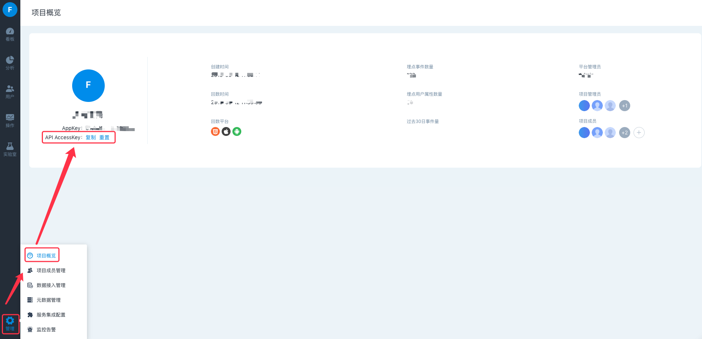
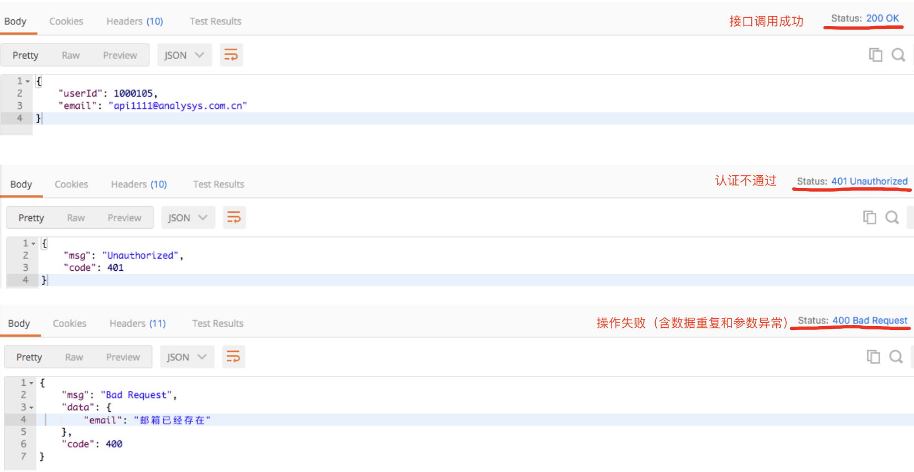

# API

## 1. 调用方法

API 采用标准的 HTTP 方式，调用的 URL 为:

```text
http://{$WEB_URL}/{$API_URL}
```

**$WEB\_URL** ：和访问方舟产品的 URL一致。

**$API\_URL** ：具体的 API 地址。


如果私有化部署的过程中修改了Nginx的默认配置，或通过CDN等访问方舟，则请咨询相关人员获取配置信息。


## 2.接口认证

所有接口调用时都需要在header中带上认证信息，接口认证分为平台接口认证和项目接口认证两种。

### 2.1 项目接口认证

用于指定项目的相关查询和操作，每个项目的AccessKey只能访问当前项目API，和项目标识appKey一起使用。参数名称使用 token，**非**平台管理API ****的接口都使用项目认证。示例如下：

```text
Request Headers
    Content-Type: application/json
    token: {$API_ACCESSKEY}
    appKey: {$APP_KEY}
```

**$APP\_KEY**为项目标识，对应方舟系统中的AppKey。

**$API\_ACCESSKEY** 为项目API调用的验证标识。可在方舟中【管理】 - 【项目概览】模块中获取，截图如下：



### 2.2 平台接口认证

主要用于项目权限之上的相关查询和操作，参数名称使用 **xtoken**，在 [平台管理API](api-manage-enterprise/) ****的接口中有使用。示例如下：

```text
Request Headers
    Content-Type: application/json
    xtoken: {$SUPER_TOKEN}
```

**$SUPER\_TOKEN** 为级超级授权码，通过联系运维获取。

## 3.调用示例

获取到 $WEB\_URL 地址和token后，就可以使用任意HTTP Client进行 API 调用，非特殊说明都使用RequestBody方式传参，例如使用 curl工具访问事件分析，例子如下：

```java
curl -H "Content-Type:application/json" -H "token:4113c9cad1c301113783f433e254888c" -H "appKey:31abd9593e9983ec" -X POST --data '{
    "measures":[
        {
            "filter":{
                "conditions":[
                    {
                        "expression":"event.$Anything.$platform",
                        "function":"EQ",
                        "params":[
                            "JS"
                        ]
                    }
                ],
                "relation":"and"
            },
            "expression":"event.$Anything",
            "aggregator":"TRIGGER_USER_COUNT"
        }
    ],
    "filter":{
        "conditions":[
            {
                "expression":"event.$Anything.$platform",
                "function":"EQ",
                "params":[
                    "JS",
                    "iOS",
                    "Android"
                ]
            }
        ],
        "relation":"AND"
    },
    "byFields":[
        {
            "expression":"event.$Anything.$screen_width",
            "buckets":[
                600,
                800
            ]
        }
    ],
    "crowds":[
        "$ALL"
    ],
    "fromDate":"2019-06-18",
    "toDate":"2019-06-20",
    "samplingFactor":1,
    "useCache":true,
    "unit":"DAY"
}' http://127.0.0.1:4005/uba/api/events/analyze
```

## 4. 接口分类

API分为分析API、用户API、管理API、平台管理API四大类。

**分析API**：通过各分析模型获取数据。



**用户API**：用户分群的创建、获取分群的用户详情等。



**管理API**：项目元事件、用户属性、项目成员管理等。



**平台管理API**：项目列表获取、项目创建、平台成员新增。



## 5. 其他

### 5.1 操作用户

管理类API涉及到新增/修改/删除，为了区分谁操作，在接口传参中都需要带当前操作人对应的邮箱，如果不用区分谁操作，默认为一个方舟中存在的邮箱即可。参数名为loginUser，通过Path方式传参。示例如下：

```java
?loginUser=操作用户的邮箱地址
```

### 5.2 接口状态码

API调用是否成功都是通过HTTP状态码来识别，接口直接返回结果结构体，以下是系统对应的状态码。

| HttpStatus | HttpMessage | 描述 |
| :--- | :--- | :--- |
| 200 | OK | 接口调用成功 |
| 400 | Bad Request | 请求失败，如参数为空，参数值错误，对象已存在，对象不能操作。 |
| 401 | Unauthorized | 认证失败，如token/appKey错误 |
| 404 | Not Found | 接口不存在 |
| 415 | Unsupported Media Type | HTTP协议的错误，如Content-Type |
| 498 | Request method not supported | HTTP请求方法不支持 |
| 499 | The maximum limit has been reached | 超出限制，如项目个数超出限额，分群个数超出限额 |
| 500 | Internal Server Error | 接口处理异常 |
| 503 | Service Unavailable | 连接服务不可用，如presto连接异常，数据库连接异常 |


HttpStatus=400时，会返回详细的错误内容（data），data中会罗列具体的错误参数。


以下是Postman调用结果示例：




