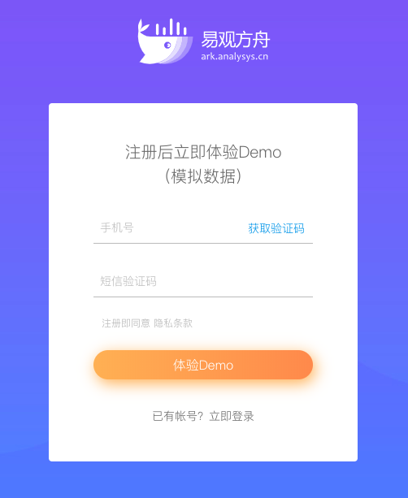
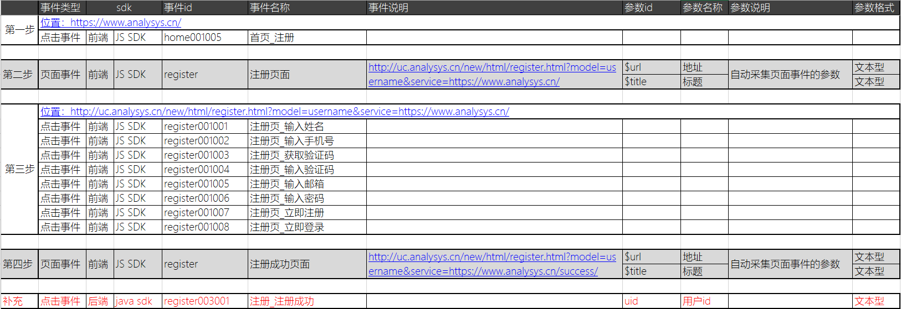

# Step 3 设计埋点方案

项目创建成功后，即可开始接入数据。但基础的数据建设决定上层的分析建筑，在开始接入数据前，一定要做好埋点规划，确定上报哪些数据什么时机上报，才能支撑最后的数据分析。

## 设计埋点方案前需确认

### 1. 现阶段的核心业务

* 验证功能设计是否合理？（关键功能）
* 按钮的点击情况？
* 关键流程的转化情况？
* banner广告/推荐位的效果转化？
* 注册/登录的用户情况？

###  2. 核心业务的关键路径

拆解各环节，设定环节指标（如各环节转化率），根据环节指标，提取动作行为，即事件，该事件就是我们要进行统计的埋点位。

## 埋点规划主要分为三个阶段

### 1. 需求整理

通常来讲，做数据分析前，必须要确定分析方法。

以注册流程为例，分析方法通常有2个：漏斗转化和点击分布。

漏斗转化分析指追踪完成几个核心步骤的人数，计算每个步骤未完成下一步的人数，找出漏损严重的关键步骤和转化失败的原因，并优化业务；更进一步的看，需要定位到未转化的人群，做用户画像分析或者做定向短信营销促转化。

点击分布指研究一个页面内用户点击各个功能的人数和次数，找出用户点击异常的环节。

结合两种分析方法，既可以定位出现问题的环节，还可以找出漏损异常的页面内出现哪些问题。

### 2. 设定指标

根据选定的分析方法，列举出所有需要用到的指标。

以注册流程为例，需要列举出每个关键事件的触发人数和次数。

1）点击官网右上角的“注册”按键，记录点击注册按键人数和次数。

2）点击立即注册页面中的“立即注册”按键，记录点击立即注册按键人数和次数。

3）记录每个文本框的激活次数和人数。如果生产环境中，点击获取验证码次数远大于输入验证码次，则大概率是因为“获取验证码”后收不到下发短信。

可选步骤：

很多场景下，用户注册流程的最后一步不局限于“完成注册页面”，还需要从服务器端采集“注册成功”的行为-即成功写入数据库后，把服务器的日志传输到方舟。

### 3. 输出埋点方案

确定分析指标后，需要向技术人员提供埋点的列表的清单，进行底层的代码部署或者可视化埋点。

此外还要提供每个事件和每个参数的命名。传输时采用英文+数字的事件id，部署后在方舟平台上注释成中文名，使用中文名称方便查询和解读。



